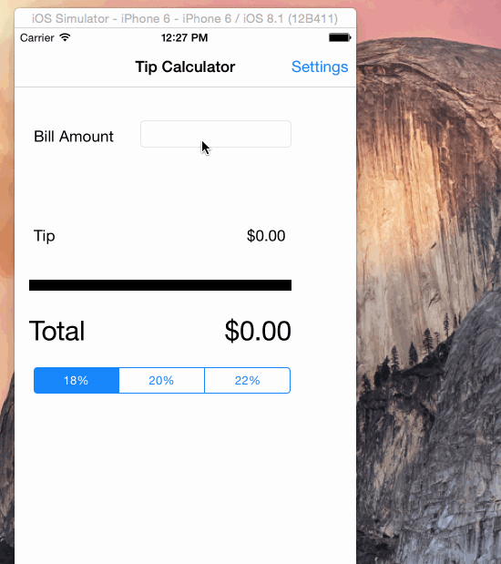

# tips2
initial build

# TipCalculator

This is a Tip Calculator application for iOS submitted as the [pre-assignment](https://gist.github.com/timothy1ee/7747214) requirement for CodePath.

Time spent: 12 hours

Completed:

* [X] Required: User can enter a bill amount, choose a tip percentage, and see the tip and total values.
* [X] Required: Settings page to change the default tip percentage.
* [] Optional: UI animations
* [] Optional: Remembering the bill amount across app restarts (if <10mins)
* [] Optional: Using locale-specific currency and currency thousands separators.
* [] Optional: Making sure the keyboard is always visible and the bill amount is always the first responder. This way the user doesn't have to tap anywhere to use this app. Just launch the app and start typing.

Note: to embed the gif file, just check your gif file into your repo and update the name of the file above.

This is an Android demo application for displaying the latest box office movies using the RottenTomatoes API. See the RottenTomatoes Networking Tutorial on our cliffnotes for a step-by-step tutorial.

Time spent: 5 hours spent in total

Completed user stories:

 Required: User can view a list of latest box office movies including title, cast and tomatoes rating
 Required: User can click on a movie in the list to bring up a details page with additional information such as synopsis
 Optional: Placeholder image is used for movie posters loaded in from the network
Notes:

Spent some time making the UI work across multiple phone resolutions by playing around with the RelativeLayout.

Walkthrough of all user stories:
